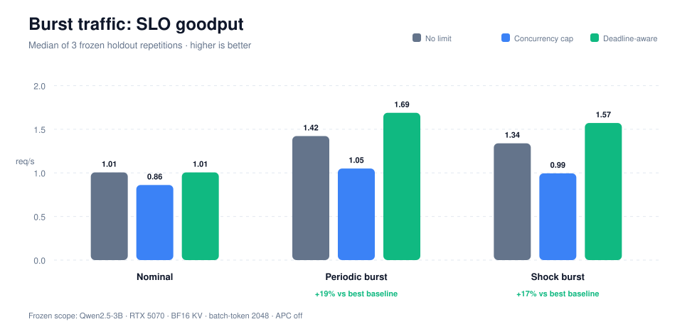
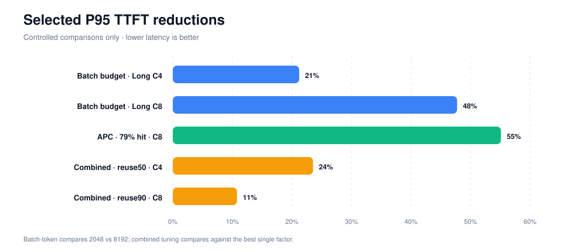
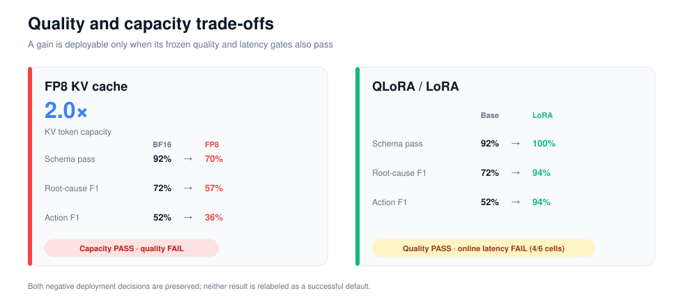
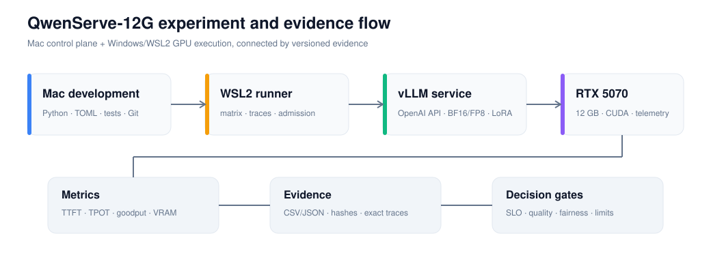

<div align="center">

# QwenServe-12G

**A reproducible single-GPU LLM serving study for latency-, quality-, and VRAM-constrained inference.**

在 RTX 5070 12GB 与 WSL2 上，围绕 Qwen2.5-3B-Instruct 构建可复现的 vLLM 推理、QLoRA 训练、质量评测和 SLO 感知准入控制闭环。

[](https://github.com/cysong2025/QwenServe-12G/actions/workflows/ci.yml)


[核心结果](#核心结果) · [系统设计](#系统设计) · [快速开始](#快速开始) · [实验文档](#实验文档) · [结论边界](#结论边界)

</div>

> [!IMPORTANT]
> 这是受控的单机 AI Infra 实验项目，不是生产流量证明。正向结果、失败实验和适用边界均保留；项目不修改 vLLM Scheduler、Engine 或 CUDA kernel。

## 项目解决什么问题

LLM 服务的 raw throughput 并不等于用户真正获得的有效服务。并发过高时，GPU 仍在持续生成 Token，但大量请求可能已经错过 TTFT/TPOT 目标。

QwenServe-12G 以 **SLO goodput** 为主要性能目标：只统计成功完成且满足 TTFT/TPOT 门槛的请求；候选服务配置还必须另行通过错误率和生成质量门槛。项目回答三个问题：

1. batch-token、前缀缓存和 KV 精度如何影响单卡延迟、吞吐与显存；
2. QLoRA 带来的任务质量收益是否值得动态 LoRA 的在线成本；
3. 突发流量下，怎样避免已经无法按时完成的请求继续占用 GPU。

## 核心结果

| 优化方向 | 读者最关心的结果 | 当前决策 |
|---|---|---|
| 容量与并发边界 | 12 组长度×并发组合中 **8 组满足 SLO**；盲目提高并发会增加吞吐，却可能减少按时完成的请求 | 作为容量基线 |
| Batch-token 调优 | 长上下文场景的 P95 首 Token 延迟降低 **约 21%～48%**，吞吐基本持平 | 长请求场景启用 |
| 前缀缓存 | 前缀命中约 79% 时，P95 首 Token 延迟 **1.41s→0.63s（降低约 55%）**，吞吐 **提升约 34%** | 高复用流量启用 |
| FP8 KV Cache | KV 容量达到 BF16 的 **约 2.0×**，但结构化输出通过率从 **92% 降至 70%** | 默认关闭 |
| Batch-token + 前缀缓存 | 相比最佳单项，P95 首 Token 延迟继续降低 **约 11%～24%** | 按负载组合启用 |
| QLoRA / LoRA | Macro-F1 **0.72→0.94**、Action F1 **0.52→0.94**；但 6 组在线测试中 4 组延迟超限 | 保留训练能力，不默认在线挂载 |
| Token-aware 准入 | 过载场景的 SLO goodput 反而下降 **约 11%～15%** | 淘汰该策略 |
| Deadline-aware 准入 | 两类突发流量的 SLO goodput 提升 **约 17%～19%** | 突发流量启用 |



Deadline-aware 外置控制器使用最大并发 8、8192 在途 Token、800 ms 排队期限和 first-fit backfill。它没有提高低负载下的物理算力；稳定流量收益为 0%，收益来自突发拥塞时更准确地分配有限 GPU 服务时间。





完整数值、统计口径和限制见 [推理优化总结](docs/E01_E06_FINAL_REPORT.md)、[LoRA 质量与部署结果](docs/E07_RESULTS.md)、[Token-aware 准入结果](docs/E08_RESULTS.md) 与 [Deadline-aware 准入结果](docs/E09_RESULTS.md)。

## 系统设计



仓库将控制面和 GPU 执行面分开：

- **Mac**：代码、配置、单元测试、报告与 Git；
- **Windows/WSL2**：vLLM 服务、QLoRA、正式 GPU benchmark 与 telemetry；
- **证据链**：TOML 配置哈希、模型/Tokenizer 指纹、seed、重复编号、trace SHA-256、CSV/JSON 汇总；
- **决策层**：TTFT、TPOT、goodput、错误率、质量和 Jain fairness 的冻结门槛。

正式矩阵支持跳过同配置哈希下的有效重复并从缺失 cell 恢复。原始请求级 artifacts 和模型权重保留在 GPU 主机，Git 只保存配置、代码与紧凑审计结果。

## 功能与技术栈

- **Serving**：vLLM 0.25.1、OpenAI-compatible API、BF16/FP8 E4M3 KV、Automatic Prefix Caching、动态 LoRA；
- **Training**：PyTorch、Transformers、PEFT、bitsandbytes、Accelerate、4-bit NF4 QLoRA；
- **Scheduling**：Python `ThreadPoolExecutor`、线程安全计数、并发/Token ceiling、有界队列、deadline expiry、backfill；
- **Observability**：vLLM Prometheus metrics、`nvidia-smi` telemetry、TTFT、TPOT、throughput、goodput、VRAM；
- **Evaluation**：schema validation、Macro/Micro-F1、固定 correctness canary、匿名配对复核；
- **Engineering**：Python 3.12、TOML、Makefile、Bash、uv、GitHub Actions、unittest、SHA-256 manifest。

## 快速开始

### 1. 在任意开发机验证仓库

```bash
git clone git@github.com:cysong2025/QwenServe-12G.git
cd QwenServe-12G
make test
make check-charts
make audit-e01-e06
```

这些命令不启动 GPU benchmark。`make check-charts` 会验证 README 图表与已提交的机器可读报告一致。

### 2. 在 Windows/WSL2 准备 GPU 环境

```bash
bash scripts/bootstrap_wsl.sh
source .venv/bin/activate
make doctor
```

默认模型目录是 `~/models/Qwen2.5-3B-Instruct`。当前网络无法稳定访问 Hugging Face 时，可使用项目提供的 ModelScope 下载入口：

```bash
make download-model-modelscope
```

### 3. 启动受控基线

终端 1：

```bash
source .venv/bin/activate
make serve-baseline-local
```

终端 2：

```bash
source .venv/bin/activate
make bench-smoke
```

正式实验不要直接复制参数临时运行。先选择对应 runbook，完成 readiness/pilot，再执行冻结矩阵。

### 4. 更新图表

```bash
make charts
make check-charts
```

图表由 `scripts/generate_readme_charts.py` 从 `reports/` 下已提交的 CSV/JSON 生成，不手工维护数字。

## 实验文档

| 入口 | 内容 |
|---|---|
| [项目章程](docs/PROJECT_CHARTER.md) | 研究问题、交付物和不做什么 |
| [实验协议](docs/EXPERIMENT_PROTOCOL.md) | 通用重复、SLO、正确性与证据规范 |
| [实验参数演进与项目总结](docs/EXPERIMENT_PARAMETER_EVOLUTION.md) | E01-E09 参数含义、调节原因、收益、失败实验与最终决策 |
| [推理优化总结](docs/E01_E06_FINAL_REPORT.md) | 推理参数、前缀缓存、FP8 KV 和组合优化 |
| [LoRA 训练协议](docs/E07_PROTOCOL.md) / [质量与部署结果](docs/E07_RESULTS.md) | QLoRA 训练、任务质量收益与在线成本 |
| [Token-aware 准入结果](docs/E08_RESULTS.md) | 未达到收益门槛的策略与原因 |
| [Deadline-aware 准入协议](docs/E09_PROTOCOL.md) / [突发流量结果](docs/E09_RESULTS.md) | holdout 设计与正向结果 |
| [GPU Runbooks](docs/M1_BASELINE_RUNBOOK.md) | 从基线到最终策略的可复制执行入口 |
| [Agent Handoff](docs/CODEX_AGENT_HANDOFF.md) | 当前分支、远程环境与冻结边界 |

## 仓库结构

```text
configs/               冻结的 serve、matrix、train 与 admission 配置
datasets/              correctness、质量评测与 QLoRA 数据清单
src/qwen_serve_lab/     CLI、实验执行、评测、准入控制与报告逻辑
tests/                 不依赖 GPU 的单元测试
reports/               提交的紧凑 CSV/JSON/Markdown 证据
docs/                  协议、runbook、结果与图表
scripts/               WSL 初始化、模型下载和图表生成
artifacts/             GPU 原始输出目录骨架；大文件不提交
```

## 结论边界

- 未运行 Transformers 单请求参考，因此不声称 vLLM 相对其他引擎的加速比；
- 前缀缓存收益只适用于存在真实前缀复用的负载；
- FP8 KV 结论基于当前在线 scale，不外推到经过代表性数据离线校准的配置；
- LoRA 代理盲评不是独立人类偏好研究，且当前动态 LoRA 不作为默认部署；
- Token-aware 准入是执行有效但策略失败的实验，不重写为正向优化；
- Deadline-aware 准入只证明冻结突发负载上的收益，不外推到持续过载、其他模型或 GPU；
- 当前仓库通过公开参数配置 vLLM，并在 HTTP API 前实现外置准入控制，**没有修改 vLLM 源码**。

所有量化结果均可追溯到 `reports/` 中的紧凑结果和对应协议。不同阶段的 318 个正式执行单元具有不同 workload 与统计口径，不能解释为 318 个独立 profile。
